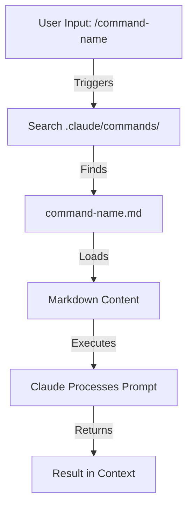
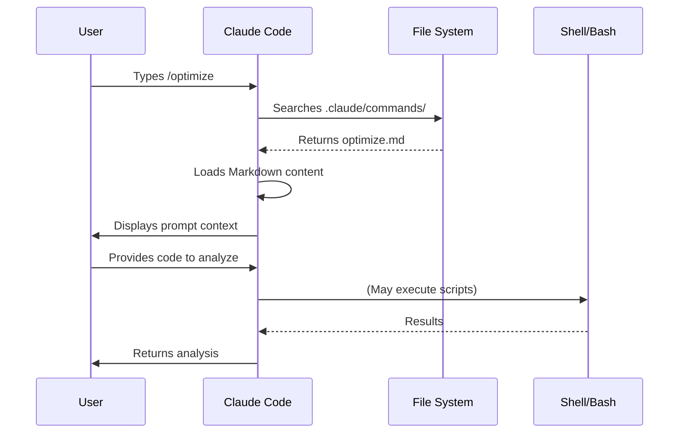

# Slash Commands

## Overview

Slash commands are tools that control Claude's behavior during an interactive session. They enable teams to standardize frequently-used prompts and workflows, and come in several types with different capabilities.

## Types of Slash Commands

| Type | Description | Example |
|------|-------------|---------|
| **Built-in** | Commands provided by Claude Code | `/help`, `/clear`, `/model` |
| **Custom** | User-defined Markdown files | `/optimize`, `/pr` |
| **Plugin** | Commands from installed plugins | `/frontend-design:frontend-design` |
| **MCP** | Commands from MCP servers | `/mcp__github__list_prs` |

## Built-in Commands Reference

Claude Code provides these built-in slash commands:

| Command | Purpose |
|---------|---------|
| `/add-dir` | Add additional working directories |
| `/agents` | Manage custom AI subagents for specialized tasks |
| `/bashes` | List and manage background tasks |
| `/bug` | Report bugs (sends conversation to Anthropic) |
| `/clear` | Clear conversation history |
| `/compact [instructions]` | Compact conversation with optional focus instructions |
| `/config` | Open the Settings interface (Config tab) |
| `/context` | Visualize current context usage as a colored grid |
| `/cost` | Show token usage statistics |
| `/doctor` | Checks the health of your Claude Code installation |
| `/exit` | Exit the REPL |
| `/export [filename]` | Export the current conversation to a file or clipboard |
| `/help` | Get usage help |
| `/hooks` | Manage hook configurations for tool events |
| `/ide` | Manage IDE integrations and show status |
| `/init` | Initialize project with `CLAUDE.md` guide |
| `/install-github-app` | Set up Claude GitHub Actions for a repository |
| `/login` | Switch Anthropic accounts |
| `/logout` | Sign out from your Anthropic account |
| `/mcp` | Manage MCP server connections and OAuth authentication |
| `/memory` | Edit `CLAUDE.md` memory files |
| `/model` | Select or change the AI model |
| `/output-style [style]` | Set the output style directly or from a selection menu |
| `/permissions` | View or update permissions |
| `/plugin` | Manage Claude Code plugins |
| `/pr-comments` | View pull request comments |
| `/privacy-settings` | View and update your privacy settings |
| `/release-notes` | View release notes |
| `/rename <name>` | Rename the current session |
| `/resume [session]` | Resume a conversation by ID or name |
| `/review` | Request code review |
| `/rewind` | Rewind the conversation and/or code |
| `/sandbox` | Enable sandboxed bash tool with filesystem and network isolation |
| `/security-review` | Complete a security review of pending changes |
| `/stats` | Visualize daily usage, session history, streaks, and model preferences |
| `/status` | Open the Settings interface (Status tab) |
| `/statusline` | Set up Claude Code's status line UI |
| `/terminal-setup` | Install Shift+Enter key binding for newlines |
| `/todos` | List current TODO items |
| `/usage` | Show plan usage limits and rate limit status |
| `/vim` | Enter vim mode for alternating insert and command modes |

## Custom Slash Commands

Custom slash commands allow you to define frequently used prompts as Markdown files that Claude Code can execute.

### File Locations

| Location | Scope | Label in `/help` | Use Case |
|----------|-------|------------------|----------|
| `.claude/commands/` | Project-specific | `(project)` | Team workflows, shared standards |
| `~/.claude/commands/` | Personal | `(user)` | Personal shortcuts across projects |

**Priority:** Project commands take precedence over personal commands with the same name.

### Namespacing with Subdirectories

Use subdirectories to group related commands:

```
.claude/commands/
├── frontend/
│   └── component.md    → /component (project:frontend)
├── deploy/
│   ├── production.md   → /production (project:deploy)
│   └── staging.md      → /staging (project:deploy)
└── optimize.md         → /optimize (project)
```

### Arguments

Commands can receive arguments in two ways:

**All arguments with `$ARGUMENTS`:**

```markdown
# .claude/commands/fix-issue.md
Fix issue #$ARGUMENTS following our coding standards
```

Usage: `/fix-issue 123 high-priority` → `$ARGUMENTS` becomes "123 high-priority"

**Individual arguments with `$1`, `$2`, etc.:**

```markdown
# .claude/commands/review-pr.md
Review PR #$1 with priority $2 and assign to $3
```

Usage: `/review-pr 456 high alice` → `$1`="456", `$2`="high", `$3`="alice"

### Bash Command Execution

Execute bash commands before the slash command runs using the `!` prefix:

```markdown
---
allowed-tools: Bash(git add:*), Bash(git status:*), Bash(git commit:*)
description: Create a git commit
---

## Context

- Current git status: !`git status`
- Current git diff: !`git diff HEAD`
- Current branch: !`git branch --show-current`
- Recent commits: !`git log --oneline -10`

## Your task

Based on the above changes, create a single git commit.
```

### File References

Include file contents in commands using the `@` prefix:

```markdown
# Reference a specific file
Review the implementation in @src/utils/helpers.js

# Reference multiple files
Compare @src/old-version.js with @src/new-version.js
```

### Thinking Mode

Slash commands can trigger extended thinking by including extended thinking keywords in the command content.

## Frontmatter

Command files support YAML frontmatter for configuration:

```markdown
---
allowed-tools: Bash(git add:*), Bash(git status:*), Bash(git commit:*)
argument-hint: [message]
description: Create a git commit
model: claude-3-5-haiku-20241022
---

Create a git commit with message: $ARGUMENTS
```

### Frontmatter Fields

| Field | Purpose | Default |
|-------|---------|---------|
| `allowed-tools` | List of tools the command can use | Inherits from conversation |
| `argument-hint` | Expected arguments for auto-completion | None |
| `description` | Brief description of the command | Uses first line from prompt |
| `model` | Specific model to use | Inherits from conversation |
| `disable-model-invocation` | Prevent SlashCommand tool from calling this | `false` |

## Plugin Commands

Plugins can provide custom slash commands that integrate with Claude Code:

```
/plugin-name:command-name
```

Or simply `/command-name` when there are no naming conflicts.

**Examples:**
```bash
/frontend-design:frontend-design
/commit-commands:commit
/code-review:code-review
```

## MCP Slash Commands

MCP servers can expose prompts as slash commands:

```
/mcp__<server-name>__<prompt-name> [arguments]
```

**Examples:**
```bash
/mcp__github__list_prs
/mcp__github__pr_review 456
/mcp__jira__create_issue "Bug title" high
```

## SlashCommand Tool

Claude can programmatically invoke custom slash commands using the SlashCommand tool.

### Enabling Programmatic Invocation

Reference the command in your prompt or `CLAUDE.md`:

```markdown
> Run /write-unit-test when you are about to start writing tests.
```

### Disabling for Specific Commands

Use the `disable-model-invocation` frontmatter field:

```markdown
---
disable-model-invocation: true
---
```

Or disable via permissions:
```
/permissions
# Add to deny rules: SlashCommand
```

### Character Budget

- **Default limit:** 15,000 characters
- **Custom limit:** Set via `SLASH_COMMAND_TOOL_CHAR_BUDGET` environment variable

## Skills vs Slash Commands

| Aspect | Slash Commands | Skills |
|--------|----------------|--------|
| **Best for** | Quick, frequently used prompts | Comprehensive capabilities with structure |
| **Files** | Single `.md` file | Directory with `SKILL.md` + resources |
| **Invocation** | Explicit (`/command`) | Automatic (context-based) |
| **Complexity** | Simple prompts | Complex workflows with multiple steps |

**Use slash commands** when you invoke the same prompt repeatedly and it fits in a single file.

**Use skills** when Claude should discover the capability automatically or multiple files/scripts are needed.

## Architecture



## Command Lifecycle Diagram



## Available Commands in This Folder

### 1. `/optimize` - Code Optimization
Analyzes code for performance issues, memory leaks, and optimization opportunities.

**Usage:**
```
/optimize
[Paste your code]
```

**Reviews for:**
- Performance bottlenecks (O(n²) operations)
- Memory leaks
- Algorithm improvements
- Caching opportunities
- Concurrency issues

### 2. `/pr` - Pull Request Preparation
Guides you through PR preparation checklist including linting, testing, and commit message formatting.

**Usage:**
```
/pr
```

**Checklist includes:**
- Running linting
- Running tests
- Reviewing git diff
- Staging changes
- Creating conventional commit messages
- Generating PR summary

**Screenshot**


### 3. `/generate-api-docs` - API Documentation Generator
Generates comprehensive API documentation from source code.

**Usage:**
```
/generate-api-docs
```

**Features:**
- Scans all files in `/src/api/`
- Extracts function signatures and JSDoc comments
- Organizes by endpoint/module
- Creates markdown with examples
- Includes request/response schemas
- Adds error documentation

### 4. `/commit` - Git Commit with Context
Creates a git commit with dynamic context from your repository.

**Usage:**
```
/commit [optional message]
```

**Features:**
- Automatically includes git status, diff, and recent commits
- Uses `allowed-tools` for git operations
- Supports optional commit message argument

## Installation

### For Project-wide Use (Team)

Copy these files to your project's `.claude/commands/` directory:

```bash
# Create commands directory if it doesn't exist
mkdir -p .claude/commands

# Copy command files
cp 01-slash-commands/*.md .claude/commands/
```

### For Personal Use

Copy to your personal Claude commands directory:

```bash
# Create personal commands directory
mkdir -p ~/.claude/commands

# Copy command files
cp 01-slash-commands/*.md ~/.claude/commands/
```

## Creating Your Own Commands

### Basic Command Template

Create a file `.claude/commands/my-command.md`:

```markdown
---
description: What this command does
argument-hint: [optional-args]
---

# Command Title

Instructions for Claude:

1. First step
2. Second step
3. Third step

Output format:
- How to format the response
- What to include
```

### Command with Full Frontmatter

```markdown
---
allowed-tools: Bash(npm test:*), Bash(npm run lint:*)
argument-hint: [--verbose] [--coverage]
description: Run tests with optional coverage report
model: claude-3-5-haiku-20241022
---

# Test Runner

Run the project tests with the following options:
- Arguments provided: $ARGUMENTS

## Context
- Current branch: !`git branch --show-current`
- Package.json scripts: @package.json

## Steps
1. Run `npm test`
2. If --coverage flag provided, generate coverage report
3. Summarize results and highlight any failures
```

## Best Practices

| Do | Don't |
|------|---------|
| Use clear, action-oriented names | Create commands for one-time tasks |
| Include `description` in frontmatter | Build complex logic in commands |
| Keep commands focused on single task | Create redundant commands |
| Version control project commands | Hardcode sensitive information |
| Organize in subdirectories | Create long lists of commands |
| Use `$ARGUMENTS` or `$1`, `$2` for dynamic input | Use abbreviated or cryptic wording |
| Use `!` prefix for dynamic context | Assume Claude knows current state |

## Troubleshooting

### Command Not Found

**Problem:** Claude doesn't recognize `/my-command`

**Solutions:**
- Check file is in `.claude/commands/` directory
- Verify filename matches command name
- Restart Claude Code session
- Check file has `.md` extension

### Command Not Executing as Expected

**Problem:** Command loads but doesn't work correctly

**Solutions:**
- Review command prompt clarity
- Add more specific instructions
- Include examples in command file
- Test with simple inputs first
- Check `allowed-tools` if using bash commands

### Personal vs Project Commands

**When to use personal commands:**
- Personal preferences/workflows
- Not relevant to team
- Experimental commands
- Cross-project shortcuts

**When to use project commands:**
- Team standards
- Project-specific workflows
- Shared conventions
- Onboarding helpers

## Related Concepts

- **[Memory](../02-memory/)** - For persistent context
- **[Skills](../03-skills/)** - For auto-invoked capabilities
- **[Subagents](../04-subagents/)** - For complex, delegated tasks
- **[Plugins](../07-plugins/)** - For bundled command collections

## Resources

- [Claude Code Slash Commands Documentation](https://code.claude.com/docs/en/slash-commands) - Official documentation
- [Discovering Claude Code Slash Commands](https://medium.com/@luongnv89/discovering-claude-code-slash-commands-cdc17f0dfb29) - Comprehensive blog post
- [Markdown Guide](https://www.markdownguide.org/)

---

*Part of the [Claude How To](../) guide series*
