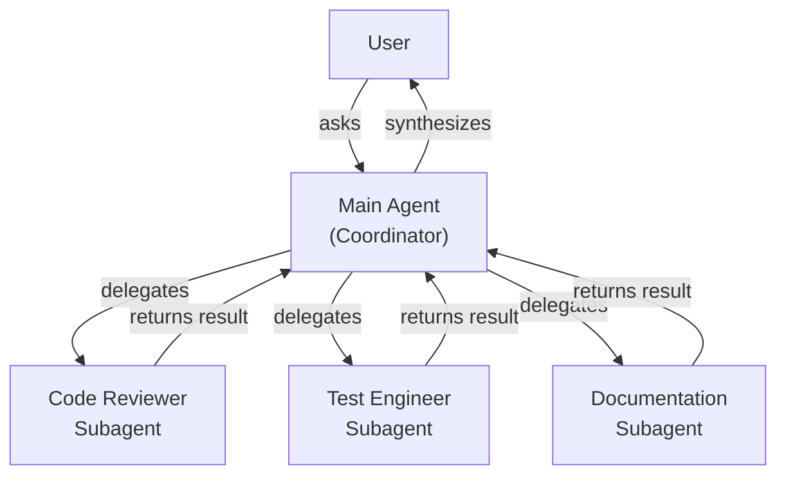
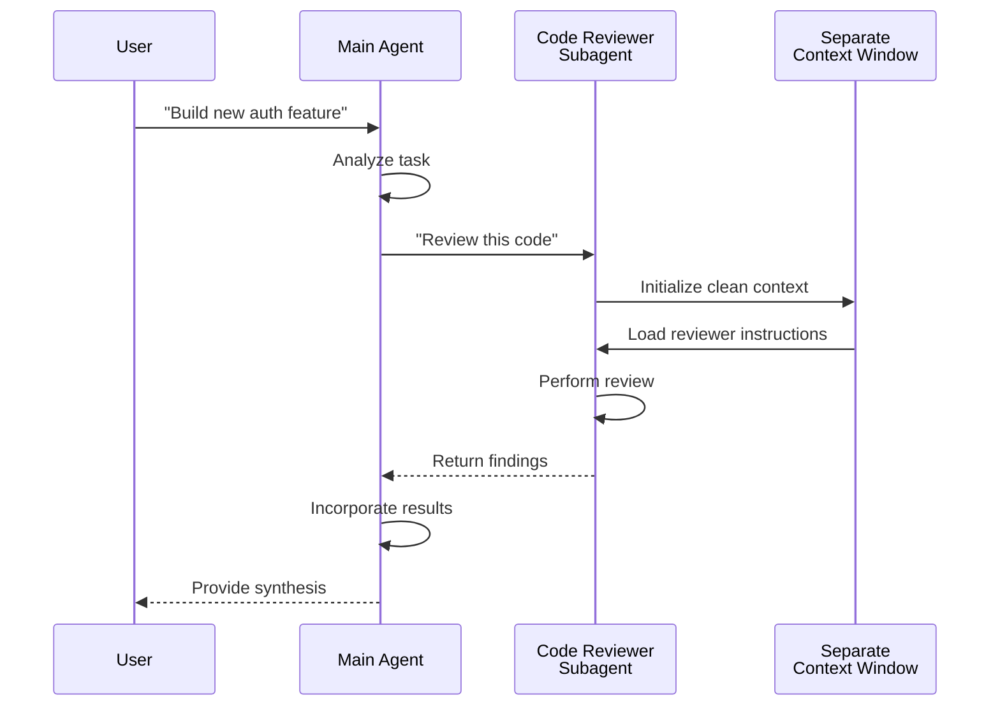
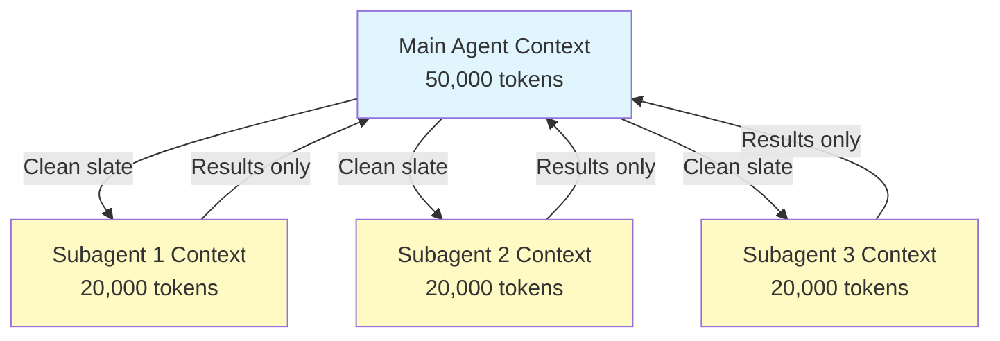
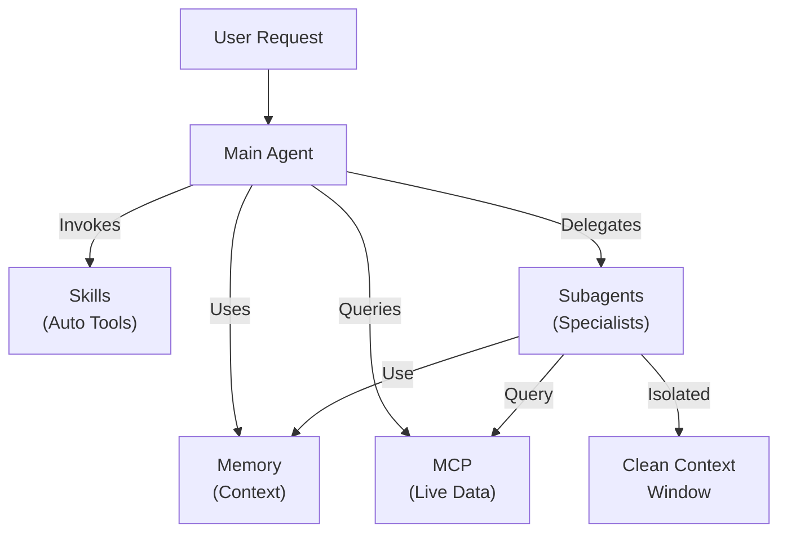

# Subagents - Complete Reference Guide

Subagents are specialized AI assistants that Claude Code can delegate tasks to. Each subagent has a specific purpose, uses its own context window separate from the main conversation, and can be configured with specific tools and a custom system prompt.

## Table of Contents

1. [Overview](#overview)
2. [Key Benefits](#key-benefits)
3. [File Locations](#file-locations)
4. [Configuration](#configuration)
5. [Built-in Subagents](#built-in-subagents)
6. [Managing Subagents](#managing-subagents)
7. [Using Subagents](#using-subagents)
8. [Resumable Agents](#resumable-agents)
9. [Chaining Subagents](#chaining-subagents)
10. [Architecture](#architecture)
11. [Context Management](#context-management)
12. [When to Use Subagents](#when-to-use-subagents)
13. [Best Practices](#best-practices)
14. [Example Subagents in This Folder](#example-subagents-in-this-folder)
15. [Installation Instructions](#installation-instructions)
16. [Related Concepts](#related-concepts)

---

## Overview

Subagents enable delegated task execution in Claude Code by:

- Creating **isolated AI assistants** with separate context windows
- Providing **customized system prompts** for specialized expertise
- Enforcing **tool access control** to limit capabilities
- Preventing **context pollution** from complex tasks
- Enabling **parallel execution** of multiple specialized tasks

Each subagent operates independently with a clean slate, receiving only the specific context necessary for their task, then returning results to the main agent for synthesis.

**Quick Start**: Use the `/agents` command to create, view, edit, and manage your subagents interactively.

---

## Key Benefits

| Benefit | Description |
|---------|-------------|
| **Context preservation** | Operates in separate context, preventing pollution of main conversation |
| **Specialized expertise** | Fine-tuned for specific domains with higher success rates |
| **Reusability** | Use across different projects and share with teams |
| **Flexible permissions** | Different tool access levels for different subagent types |
| **Scalability** | Multiple agents work on different aspects simultaneously |

---

## File Locations

Subagent files can be stored in multiple locations with different scopes:

| Type | Location | Scope | Priority |
|------|----------|-------|----------|
| **Project subagents** | `.claude/agents/` | Current project | Highest |
| **User subagents** | `~/.claude/agents/` | All projects | Lower |
| **Plugin agents** | `plugins/agents/` | Via plugins | Varies |
| **CLI-defined** | Via `--agents` flag | Session-specific | Medium |

When duplicate names exist, project-level subagents take priority over user-level ones.

---

## Configuration

### File Format

Subagents are defined in YAML frontmatter followed by the system prompt in markdown:

```yaml
---
name: your-sub-agent-name
description: Description of when this subagent should be invoked
tools: tool1, tool2, tool3  # Optional - inherits all tools if omitted
model: sonnet  # Optional - specify model alias or 'inherit'
permissionMode: default  # Optional - permission mode
skills: skill1, skill2  # Optional - skills to auto-load
hooks:  # Optional - component-scoped hooks
  PreToolUse:
    - matcher: "Bash"
      hooks:
        - type: command
          command: "./scripts/security-check.sh"
---

Your subagent's system prompt goes here. This can be multiple paragraphs
and should clearly define the subagent's role, capabilities, and approach
to solving problems.
```

### Configuration Fields

| Field | Required | Description |
|-------|----------|-------------|
| `name` | Yes | Unique identifier (lowercase letters and hyphens) |
| `description` | Yes | Natural language description of purpose. Include "use PROACTIVELY" to encourage automatic invocation |
| `tools` | No | Comma-separated list of specific tools. Omit to inherit all tools |
| `model` | No | Model to use: `sonnet`, `opus`, `haiku`, or `inherit`. Defaults to configured subagent model |
| `permissionMode` | No | `default`, `acceptEdits`, `bypassPermissions`, `plan`, `ignore` |
| `skills` | No | Comma-separated list of skills to auto-load |
| `hooks` | No | Component-scoped hooks (PreToolUse, PostToolUse, Stop) |

### Tool Configuration Options

**Option 1: Inherit All Tools (omit the field)**
```yaml
---
name: full-access-agent
description: Agent with all available tools
---
```

**Option 2: Specify Individual Tools**
```yaml
---
name: limited-agent
description: Agent with specific tools only
tools: Read, Grep, Glob, Bash
---
```

**Option 3: Conditional Tool Access**
```yaml
---
name: conditional-agent
description: Agent with filtered tool access
tools: Read, Bash(npm:*), Bash(test:*)
---
```

### CLI-Based Configuration

Define subagents for a single session using the `--agents` flag with JSON format:

```bash
claude --agents '{
  "code-reviewer": {
    "description": "Expert code reviewer. Use proactively after code changes.",
    "prompt": "You are a senior code reviewer. Focus on code quality, security, and best practices.",
    "tools": ["Read", "Grep", "Glob", "Bash"],
    "model": "sonnet"
  }
}'
```

**JSON Format for `--agents` flag:**

```json
{
  "agent-name": {
    "description": "Required: when to invoke this agent",
    "prompt": "Required: system prompt for the agent",
    "tools": ["Optional", "array", "of", "tools"],
    "model": "optional: sonnet|opus|haiku"
  }
}
```

**Priority of Agent Definitions:**

Agent definitions are loaded with this priority order (first match wins):
1. **CLI-defined** - `--agents` flag (session-specific)
2. **User-level** - `~/.claude/agents/` (all projects)
3. **Project-level** - `.claude/agents/` (current project)

This allows CLI definitions to override both user and project agents for a single session.

---

## Built-in Subagents

Claude Code includes three built-in subagents that are always available:

### 1. General-Purpose Subagent

| Property | Value |
|----------|-------|
| **Model** | Sonnet |
| **Tools** | All tools |
| **Purpose** | Complex research tasks, multi-step operations, code modifications |

**When used**: Tasks requiring both exploration and modification with complex reasoning.

### 2. Plan Subagent

| Property | Value |
|----------|-------|
| **Model** | Sonnet |
| **Tools** | Read, Glob, Grep, Bash |
| **Purpose** | Used automatically in plan mode to research codebase |

**When used**: When Claude needs to understand the codebase before presenting a plan.

### 3. Explore Subagent

| Property | Value |
|----------|-------|
| **Model** | Haiku (fast, low-latency) |
| **Mode** | Strictly read-only |
| **Tools** | Glob, Grep, Read, Bash (read-only commands only) |
| **Purpose** | Fast codebase searching and analysis |

**When used**: When searching/understanding code without making changes.

**Thoroughness Levels** - Specify the depth of exploration:
- **"quick"** - Fast searches with minimal exploration, good for finding specific patterns
- **"medium"** - Moderate exploration, balanced speed and thoroughness, default approach
- **"very thorough"** - Comprehensive analysis across multiple locations and naming conventions, may take longer

---

## Managing Subagents

### Using the `/agents` Command (Recommended)

```bash
/agents
```

This provides an interactive menu to:
- View all available subagents (built-in, user, and project)
- Create new subagents with guided setup
- Edit existing custom subagents and tool access
- Delete custom subagents
- See which subagents are active when duplicates exist

### Direct File Management

```bash
# Create a project subagent
mkdir -p .claude/agents
cat > .claude/agents/test-runner.md << 'EOF'
---
name: test-runner
description: Use proactively to run tests and fix failures
---

You are a test automation expert. When you see code changes, proactively
run the appropriate tests. If tests fail, analyze the failures and fix
them while preserving the original test intent.
EOF

# Create a user subagent (available in all projects)
mkdir -p ~/.claude/agents
```

---

## Using Subagents

### Automatic Delegation

Claude proactively delegates tasks based on:
- Task description in your request
- The `description` field in subagent configurations
- Current context and available tools

To encourage proactive use, include "use PROACTIVELY" or "MUST BE USED" in your `description` field:

```yaml
---
name: code-reviewer
description: Expert code review specialist. Use PROACTIVELY after writing or modifying code.
---
```

### Explicit Invocation

You can explicitly request a specific subagent:

```
> Use the test-runner subagent to fix failing tests
> Have the code-reviewer subagent look at my recent changes
> Ask the debugger subagent to investigate this error
```

---

## Resumable Agents

Subagents can continue previous conversations with full context preserved:

```bash
# Initial invocation
> Use the code-analyzer agent to start reviewing the authentication module
# Returns agentId: "abc123"

# Resume the agent later
> Resume agent abc123 and now analyze the authorization logic as well
```

**Use cases**:
- Long-running research across multiple sessions
- Iterative refinement without losing context
- Multi-step workflows maintaining context

---

## Chaining Subagents

Execute multiple subagents in sequence:

```bash
> First use the code-analyzer subagent to find performance issues,
  then use the optimizer subagent to fix them
```

This enables complex workflows where the output of one subagent feeds into another.

---

## Architecture

### High-Level Architecture



### Subagent Lifecycle



---

## Context Management



### Key Points

- Each subagent gets a **fresh context window** without the main conversation history
- Only the **relevant context** is passed to the subagent for their specific task
- Results are **distilled** back to the main agent
- This prevents **context token exhaustion** on long projects

### Performance Considerations

- **Context efficiency** - Agents preserve main context, enabling longer sessions
- **Latency** - Subagents start with clean slate and may add latency gathering initial context

---

## When to Use Subagents

| Scenario | Use Subagent | Why |
|----------|--------------|-----|
| Complex feature with many steps | Yes | Separate concerns, prevent context pollution |
| Quick code review | No | Unnecessary overhead |
| Parallel task execution | Yes | Each subagent has own context |
| Specialized expertise needed | Yes | Custom system prompts |
| Long-running analysis | Yes | Prevents main context exhaustion |
| Single task | No | Adds latency unnecessarily |

---

## Best Practices

### Design Principles

**Do:**
- Start with Claude-generated agents - Generate initial subagent with Claude, then iterate to customize
- Design focused subagents - Single, clear responsibilities rather than one doing everything
- Write detailed prompts - Include specific instructions, examples, and constraints
- Limit tool access - Grant only necessary tools for the subagent's purpose
- Version control - Check project subagents into version control for team collaboration

**Don't:**
- Create overlapping subagents with same roles
- Give subagents unnecessary tool access
- Use subagents for simple, single-step tasks
- Mix concerns in one subagent's prompt
- Forget to pass necessary context

### System Prompt Best Practices

1. **Be Specific About Role**
   ```
   You are an expert code reviewer specializing in [specific areas]
   ```

2. **Define Priorities Clearly**
   ```
   Review priorities (in order):
   1. Security Issues
   2. Performance Problems
   3. Code Quality
   ```

3. **Specify Output Format**
   ```
   For each issue provide: Severity, Category, Location, Description, Fix, Impact
   ```

4. **Include Action Steps**
   ```
   When invoked:
   1. Run git diff to see recent changes
   2. Focus on modified files
   3. Begin review immediately
   ```

### Tool Access Strategy

1. **Start Restrictive**: Begin with only essential tools
2. **Expand Only When Needed**: Add tools as requirements demand
3. **Read-Only When Possible**: Use Read/Grep for analysis agents
4. **Sandboxed Execution**: Limit Bash commands to specific patterns

---

## Example Subagents in This Folder

This folder contains ready-to-use example subagents:

### 1. Code Reviewer (`code-reviewer.md`)

**Purpose**: Comprehensive code quality and maintainability analysis

**Tools**: Read, Grep, Glob, Bash

**Specialization**:
- Security vulnerability detection
- Performance optimization identification
- Code maintainability assessment
- Test coverage analysis

**Use When**: You need automated code reviews with focus on quality and security

---

### 2. Test Engineer (`test-engineer.md`)

**Purpose**: Test strategy, coverage analysis, and automated testing

**Tools**: Read, Write, Bash, Grep

**Specialization**:
- Unit test creation
- Integration test design
- Edge case identification
- Coverage analysis (>80% target)

**Use When**: You need comprehensive test suite creation or coverage analysis

---

### 3. Documentation Writer (`documentation-writer.md`)

**Purpose**: Technical documentation, API docs, and user guides

**Tools**: Read, Write, Grep

**Specialization**:
- API endpoint documentation
- User guide creation
- Architecture documentation
- Code comment improvement

**Use When**: You need to create or update project documentation

---

### 4. Secure Reviewer (`secure-reviewer.md`)

**Purpose**: Security-focused code review with minimal permissions

**Tools**: Read, Grep

**Specialization**:
- Security vulnerability detection
- Authentication/authorization issues
- Data exposure risks
- Injection attack identification

**Use When**: You need security audits without modification capabilities

---

### 5. Implementation Agent (`implementation-agent.md`)

**Purpose**: Full implementation capabilities for feature development

**Tools**: Read, Write, Edit, Bash, Grep, Glob

**Specialization**:
- Feature implementation
- Code generation
- Build and test execution
- Codebase modification

**Use When**: You need a subagent to implement features end-to-end

---

### 6. Debugger (`debugger.md`)

**Purpose**: Debugging specialist for errors, test failures, and unexpected behavior

**Tools**: Read, Edit, Bash, Grep, Glob

**Specialization**:
- Root cause analysis
- Error investigation
- Test failure resolution
- Minimal fix implementation

**Use When**: You encounter bugs, errors, or unexpected behavior

---

### 7. Data Scientist (`data-scientist.md`)

**Purpose**: Data analysis expert for SQL queries and data insights

**Tools**: Bash, Read, Write

**Specialization**:
- SQL query optimization
- BigQuery operations
- Data analysis and visualization
- Statistical insights

**Use When**: You need data analysis, SQL queries, or BigQuery operations

---

## Installation Instructions

### Method 1: Using /agents Command (Recommended)

```bash
/agents
```

Then:
1. Select 'Create New Agent'
2. Choose project-level or user-level
3. Describe your subagent in detail
4. Select tools to grant access (or leave blank to inherit all)
5. Save and use

### Method 2: Copy to Project

Copy the agent files to your project's `.claude/agents/` directory:

```bash
# Navigate to your project
cd /path/to/your/project

# Create agents directory if it doesn't exist
mkdir -p .claude/agents

# Copy all agent files from this folder
cp /path/to/04-subagents/*.md .claude/agents/

# Remove the README (not needed in .claude/agents)
rm .claude/agents/README.md
```

### Method 3: Copy to User Directory

For agents available in all your projects:

```bash
# Create user agents directory
mkdir -p ~/.claude/agents

# Copy agents
cp /path/to/04-subagents/code-reviewer.md ~/.claude/agents/
cp /path/to/04-subagents/debugger.md ~/.claude/agents/
# ... copy others as needed
```

### Verification

After installation, verify the agents are recognized:

```bash
/agents
```

You should see your installed agents listed alongside the built-in ones.

---

## File Structure

```
project/
├── .claude/
│   └── agents/
│       ├── code-reviewer.md
│       ├── test-engineer.md
│       ├── documentation-writer.md
│       ├── secure-reviewer.md
│       ├── implementation-agent.md
│       ├── debugger.md
│       └── data-scientist.md
└── ...
```

---

## Related Concepts

### Related Features

- **[Slash Commands](../01-slash-commands/)** - Quick user-invoked shortcuts
- **[Memory](../02-memory/)** - Persistent cross-session context
- **[Skills](../03-skills/)** - Reusable autonomous capabilities
- **[MCP Protocol](../05-mcp/)** - Real-time external data access
- **[Hooks](../06-hooks/)** - Event-driven shell command automation
- **[Plugins](../07-plugins/)** - Bundled extension packages

### Comparison with Other Features

| Feature | User-Invoked | Auto-Invoked | Persistent | External Access | Isolated Context |
|---------|--------------|--------------|-----------|------------------|------------------|
| **Slash Commands** | Yes | No | No | No | No |
| **Subagents** | Yes | Yes | No | No | Yes |
| **Memory** | Auto | Auto | Yes | No | No |
| **MCP** | Auto | Yes | No | Yes | No |
| **Skills** | Yes | Yes | No | No | No |

### Integration Pattern



---

## Additional Resources

- [Official Subagents Documentation](https://code.claude.com/docs/en/sub-agents)
- [CLI Reference](https://code.claude.com/docs/en/cli-reference) - `--agents` flag and other CLI options
- [Plugins Guide](../07-plugins/) - For bundling agents with other features
- [Skills Guide](../03-skills/) - For auto-invoked capabilities
- [Memory Guide](../02-memory/) - For persistent context
- [Hooks Guide](../06-hooks/) - For event-driven automation

---

*Last updated: December 2024*

*This guide covers complete subagent configuration, delegation patterns, and best practices for Claude Code.*
