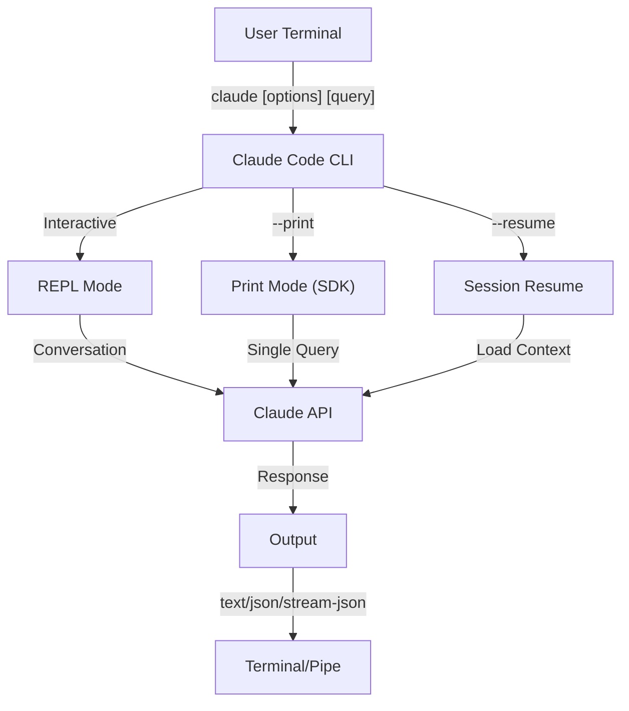
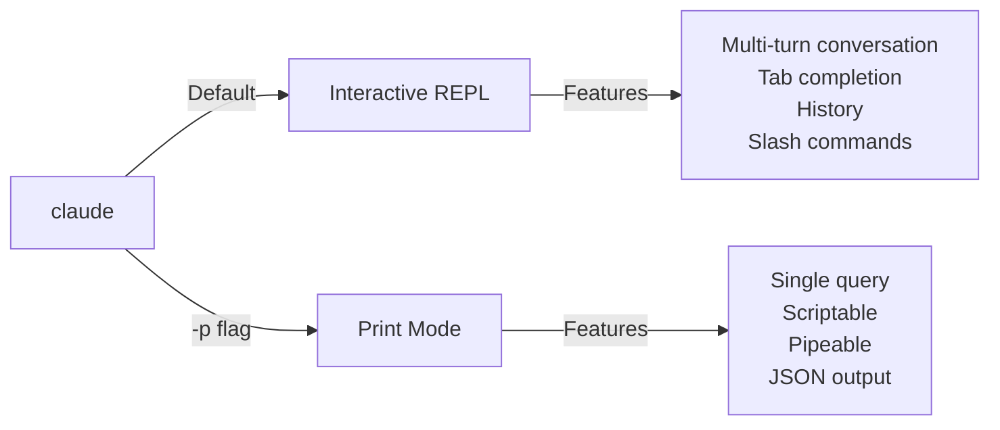

<picture>
  <source media="(prefers-color-scheme: dark)" srcset="../resources/logos/claude-howto-logo-dark.svg">
  
</picture>

# CLI Reference

## Overview

The Claude Code CLI (Command Line Interface) is the primary way to interact with Claude Code. It provides powerful options for running queries, managing sessions, configuring models, and integrating Claude into your development workflows.

## Architecture



## CLI Commands

| Command | Description | Example |
|---------|-------------|---------|
| `claude` | Start interactive REPL | `claude` |
| `claude "query"` | Start REPL with initial prompt | `claude "explain this project"` |
| `claude -p "query"` | Print mode - query then exit | `claude -p "explain this function"` |
| `cat file \| claude -p "query"` | Process piped content | `cat logs.txt \| claude -p "explain"` |
| `claude -c` | Continue most recent conversation | `claude -c` |
| `claude -c -p "query"` | Continue in print mode | `claude -c -p "check for type errors"` |
| `claude -r "<session>" "query"` | Resume session by ID or name | `claude -r "auth-refactor" "finish this PR"` |
| `claude update` | Update to latest version | `claude update` |
| `claude mcp` | Configure MCP servers | See [MCP documentation](../05-mcp/) |

## Core Flags

| Flag | Description | Example |
|------|-------------|---------|
| `-p, --print` | Print response without interactive mode | `claude -p "query"` |
| `-c, --continue` | Load most recent conversation | `claude --continue` |
| `-r, --resume` | Resume specific session by ID or name | `claude --resume auth-refactor` |
| `-v, --version` | Output version number | `claude -v` |

### Interactive vs Print Mode



**Interactive Mode** (default):
```bash
# Start interactive session
claude

# Start with initial prompt
claude "explain the authentication flow"
```

**Print Mode** (non-interactive):
```bash
# Single query, then exit
claude -p "what does this function do?"

# Process file content
cat error.log | claude -p "explain this error"

# Chain with other tools
claude -p "list todos" | grep "URGENT"
```

## Model & Configuration

| Flag | Description | Example |
|------|-------------|---------|
| `--model` | Set model (sonnet, opus, haiku, or full name) | `claude --model opus` |
| `--fallback-model` | Fallback when overloaded (print mode) | `claude -p --fallback-model sonnet "query"` |
| `--agent` | Specify agent for session | `claude --agent my-custom-agent` |
| `--agents` | Define custom subagents via JSON | See [Agents Configuration](#agents-configuration) |

### Model Selection Examples

```bash
# Use Opus for complex tasks
claude --model opus "design a caching strategy"

# Use Haiku for quick tasks
claude --model haiku -p "format this JSON"

# Full model name
claude --model claude-sonnet-4-5-20250929 "review this code"

# With fallback for reliability
claude -p --model opus --fallback-model sonnet "analyze architecture"
```

## System Prompt Customization

| Flag | Description | Example |
|------|-------------|---------|
| `--system-prompt` | Replace entire default prompt | `claude --system-prompt "You are a Python expert"` |
| `--system-prompt-file` | Load prompt from file (print mode) | `claude -p --system-prompt-file ./prompt.txt "query"` |
| `--append-system-prompt` | Append to default prompt | `claude --append-system-prompt "Always use TypeScript"` |

### System Prompt Examples

```bash
# Complete custom persona
claude --system-prompt "You are a senior security engineer. Focus on vulnerabilities."

# Append specific instructions
claude --append-system-prompt "Always include unit tests with code examples"

# Load complex prompt from file
claude -p --system-prompt-file ./prompts/code-reviewer.txt "review main.py"
```

### System Prompt Flags Comparison

| Flag | Behavior | Interactive | Print |
|------|----------|-------------|-------|
| `--system-prompt` | Replaces entire default system prompt | ✅ | ✅ |
| `--system-prompt-file` | Replaces with prompt from file | ❌ | ✅ |
| `--append-system-prompt` | Appends to default system prompt | ✅ | ✅ |

**Use `--system-prompt-file` only in print mode. For interactive mode, use `--system-prompt` or `--append-system-prompt`.**

## Tool & Permission Management

| Flag | Description | Example |
|------|-------------|---------|
| `--tools` | Specify available tools | `claude -p --tools "Bash,Edit,Read" "query"` |
| `--allowedTools` | Tools that execute without prompting | `"Bash(git log:*)" "Read"` |
| `--disallowedTools` | Tools removed from context | `"Bash(rm:*)" "Edit"` |
| `--dangerously-skip-permissions` | Skip all permission prompts | `claude --dangerously-skip-permissions` |
| `--permission-mode` | Begin in specified permission mode | `claude --permission-mode plan` |
| `--permission-prompt-tool` | MCP tool for permission handling | `claude -p --permission-prompt-tool mcp_auth "query"` |

### Permission Examples

```bash
# Read-only mode for code review
claude --permission-mode plan "review this codebase"

# Restrict to safe tools only
claude --tools "Read,Grep,Glob" -p "find all TODO comments"

# Allow specific git commands without prompts
claude --allowedTools "Bash(git status:*)" "Bash(git log:*)"

# Block dangerous operations
claude --disallowedTools "Bash(rm -rf:*)" "Bash(git push --force:*)"
```

## Output & Format

| Flag | Description | Options | Example |
|------|-------------|---------|---------|
| `--output-format` | Specify output format (print mode) | text, json, stream-json | `claude -p --output-format json "query"` |
| `--input-format` | Specify input format (print mode) | text, stream-json | `claude -p --input-format stream-json` |
| `--verbose` | Enable verbose logging | | `claude --verbose` |
| `--include-partial-messages` | Include streaming events | Requires stream-json | `claude -p --output-format stream-json --include-partial-messages "query"` |
| `--json-schema` | Get validated JSON matching schema | | `claude -p --json-schema '{"type":"object"}' "query"` |

### Output Format Examples

```bash
# Plain text (default)
claude -p "explain this code"

# JSON for programmatic use
claude -p --output-format json "list all functions in main.py"

# Streaming JSON for real-time processing
claude -p --output-format stream-json "generate a long report"

# Structured output with schema validation
claude -p --json-schema '{"type":"object","properties":{"bugs":{"type":"array"}}}' \
  "find bugs in this code and return as JSON"
```

## Workspace & Directory

| Flag | Description | Example |
|------|-------------|---------|
| `--add-dir` | Add additional working directories | `claude --add-dir ../apps ../lib` |
| `--setting-sources` | Load setting sources | `claude --setting-sources user,project` |
| `--settings` | Load settings from file or JSON | `claude --settings ./settings.json` |

### Multi-Directory Example

```bash
# Work across multiple project directories
claude --add-dir ../frontend ../backend ../shared "find all API endpoints"

# Load custom settings
claude --settings '{"model":"opus","verbose":true}' "complex task"
```

## MCP Configuration

| Flag | Description | Example |
|------|-------------|---------|
| `--mcp-config` | Load MCP servers from JSON | `claude --mcp-config ./mcp.json` |
| `--strict-mcp-config` | Only use specified MCP servers | `claude --strict-mcp-config --mcp-config ./mcp.json` |

### MCP Examples

```bash
# Load GitHub MCP server
claude --mcp-config ./github-mcp.json "list open PRs"

# Strict mode - only specified servers
claude --strict-mcp-config --mcp-config ./production-mcp.json "deploy to staging"
```

## Session Management

| Flag | Description | Example |
|------|-------------|---------|
| `--session-id` | Use specific session ID (UUID) | `claude --session-id "550e8400-..."` |
| `--fork-session` | Create new session when resuming | `claude --resume abc123 --fork-session` |

### Session Examples

```bash
# Continue last conversation
claude -c

# Resume named session
claude -r "feature-auth" "continue implementing login"

# Fork session for experimentation
claude --resume feature-auth --fork-session "try alternative approach"

# Use specific session ID
claude --session-id "550e8400-e29b-41d4-a716-446655440000" "continue"
```

### Session Fork

Create a branch from an existing session for experimentation:

```bash
# Fork a session to try a different approach
claude --resume abc123 --fork-session "try alternative implementation"

# Fork with a custom message
claude -r "feature-auth" --fork-session "test with different architecture"
```

**Use Cases:**
- Try alternative implementations without losing the original session
- Experiment with different approaches in parallel
- Create branches from successful work for variations
- Test breaking changes without affecting the main session

The original session remains unchanged, and the fork becomes a new independent session.

## Advanced Features

| Flag | Description | Example |
|------|-------------|---------|
| `--chrome` | Enable Chrome browser integration | `claude --chrome` |
| `--no-chrome` | Disable Chrome browser integration | `claude --no-chrome` |
| `--ide` | Auto-connect to IDE if available | `claude --ide` |
| `--max-turns` | Limit agentic turns (non-interactive) | `claude -p --max-turns 3 "query"` |
| `--debug` | Enable debug mode with filtering | `claude --debug "api,mcp"` |
| `--enable-lsp-logging` | Enable verbose LSP logging | `claude --enable-lsp-logging` |
| `--betas` | Beta headers for API requests | `claude --betas interleaved-thinking` |
| `--plugin-dir` | Load plugins from directory (repeatable) | `claude --plugin-dir ./my-plugin` |

### Advanced Examples

```bash
# Limit autonomous actions
claude -p --max-turns 5 "refactor this module"

# Debug API calls
claude --debug "api" "test query"

# Enable IDE integration
claude --ide "help me with this file"
```

## Agents Configuration

The `--agents` flag accepts a JSON object defining custom subagents for a session.

### Agents JSON Format

```json
{
  "agent-name": {
    "description": "Required: when to invoke this agent",
    "prompt": "Required: system prompt for the agent",
    "tools": ["Optional", "array", "of", "tools"],
    "model": "optional: sonnet|opus|haiku"
  }
}
```

**Required Fields:**
- `description` - Natural language description of when to use this agent
- `prompt` - System prompt that defines the agent's role and behavior

**Optional Fields:**
- `tools` - Array of available tools (inherits all if omitted)
  - Format: `["Read", "Grep", "Glob", "Bash"]`
- `model` - Model to use: `sonnet`, `opus`, or `haiku`

### Complete Agents Example

```json
{
  "code-reviewer": {
    "description": "Expert code reviewer. Use proactively after code changes.",
    "prompt": "You are a senior code reviewer. Focus on code quality, security, and best practices.",
    "tools": ["Read", "Grep", "Glob", "Bash"],
    "model": "sonnet"
  },
  "debugger": {
    "description": "Debugging specialist for errors and test failures.",
    "prompt": "You are an expert debugger. Analyze errors, identify root causes, and provide fixes.",
    "tools": ["Read", "Edit", "Bash", "Grep"],
    "model": "opus"
  },
  "documenter": {
    "description": "Documentation specialist for generating guides.",
    "prompt": "You are a technical writer. Create clear, comprehensive documentation.",
    "tools": ["Read", "Write"],
    "model": "haiku"
  }
}
```

### Agents Command Examples

```bash
# Define custom agents inline
claude --agents '{
  "security-auditor": {
    "description": "Security specialist for vulnerability analysis",
    "prompt": "You are a security expert. Find vulnerabilities and suggest fixes.",
    "tools": ["Read", "Grep", "Glob"],
    "model": "opus"
  }
}' "audit this codebase for security issues"

# Load agents from file
claude --agents "$(cat ~/.claude/agents.json)" "review the auth module"

# Combine with other flags
claude -p --agents "$(cat agents.json)" --model sonnet "analyze performance"
```

### Agent Priority

When multiple agent definitions exist, they are loaded in this priority order:
1. **CLI-defined** (`--agents` flag) - Session-specific
2. **User-level** (`~/.claude/agents/`) - All projects
3. **Project-level** (`.claude/agents/`) - Current project

CLI-defined agents override both user and project agents for the session.

---

## High-Value Use Cases

### 1. CI/CD Integration

Use Claude Code in your CI/CD pipelines for automated code review, testing, and documentation.

**GitHub Actions Example:**

```yaml
name: AI Code Review

on: [pull_request]

jobs:
  review:
    runs-on: ubuntu-latest
    steps:
      - uses: actions/checkout@v4

      - name: Install Claude Code
        run: npm install -g @anthropic-ai/claude-code

      - name: Run Code Review
        env:
          ANTHROPIC_API_KEY: ${{ secrets.ANTHROPIC_API_KEY }}
        run: |
          claude -p --output-format json \
            --max-turns 1 \
            "Review the changes in this PR for:
            - Security vulnerabilities
            - Performance issues
            - Code quality
            Output as JSON with 'issues' array" > review.json

      - name: Post Review Comment
        uses: actions/github-script@v7
        with:
          script: |
            const fs = require('fs');
            const review = JSON.parse(fs.readFileSync('review.json', 'utf8'));
            // Process and post review comments
```

**Jenkins Pipeline:**

```groovy
pipeline {
    agent any
    stages {
        stage('AI Review') {
            steps {
                sh '''
                    claude -p --output-format json \
                      --max-turns 3 \
                      "Analyze test coverage and suggest missing tests" \
                      > coverage-analysis.json
                '''
            }
        }
    }
}
```

### 2. Script Piping

Process files, logs, and data through Claude for analysis.

**Log Analysis:**

```bash
# Analyze error logs
tail -1000 /var/log/app/error.log | claude -p "summarize these errors and suggest fixes"

# Find patterns in access logs
cat access.log | claude -p "identify suspicious access patterns"

# Analyze git history
git log --oneline -50 | claude -p "summarize recent development activity"
```

**Code Processing:**

```bash
# Review a specific file
cat src/auth.ts | claude -p "review this authentication code for security issues"

# Generate documentation
cat src/api/*.ts | claude -p "generate API documentation in markdown"

# Find TODOs and prioritize
grep -r "TODO" src/ | claude -p "prioritize these TODOs by importance"
```

### 3. Multi-Session Workflows

Manage complex projects with multiple conversation threads.

```bash
# Start a feature branch session
claude -r "feature-auth" "let's implement user authentication"

# Later, continue the session
claude -r "feature-auth" "add password reset functionality"

# Fork to try an alternative approach
claude --resume feature-auth --fork-session "try OAuth instead"

# Switch between different feature sessions
claude -r "feature-payments" "continue with Stripe integration"
```

### 4. Custom Agent Configuration

Define specialized agents for your team's workflows.

```bash
# Save agents config to file
cat > ~/.claude/agents.json << 'EOF'
{
  "reviewer": {
    "description": "Code reviewer for PR reviews",
    "prompt": "Review code for quality, security, and maintainability.",
    "model": "opus"
  },
  "documenter": {
    "description": "Documentation specialist",
    "prompt": "Generate clear, comprehensive documentation.",
    "model": "sonnet"
  },
  "refactorer": {
    "description": "Code refactoring expert",
    "prompt": "Suggest and implement clean code refactoring.",
    "tools": ["Read", "Edit", "Glob"]
  }
}
EOF

# Use agents in session
claude --agents "$(cat ~/.claude/agents.json)" "review the auth module"
```

### 5. Batch Processing

Process multiple queries with consistent settings.

```bash
# Process multiple files
for file in src/*.ts; do
  echo "Processing $file..."
  claude -p --model haiku "summarize this file: $(cat $file)" >> summaries.md
done

# Batch code review
find src -name "*.py" -exec sh -c '
  echo "## $1" >> review.md
  cat "$1" | claude -p "brief code review" >> review.md
' _ {} \;

# Generate tests for all modules
for module in $(ls src/modules/); do
  claude -p "generate unit tests for src/modules/$module" > "tests/$module.test.ts"
done
```

### 6. Security-Conscious Development

Use permission controls for safe operation.

```bash
# Read-only security audit
claude --permission-mode plan \
  --tools "Read,Grep,Glob" \
  "audit this codebase for security vulnerabilities"

# Block dangerous commands
claude --disallowedTools "Bash(rm:*)" "Bash(curl:*)" "Bash(wget:*)" \
  "help me clean up this project"

# Restricted automation
claude -p --max-turns 2 \
  --allowedTools "Read" "Glob" \
  "find all hardcoded credentials"
```

### 7. JSON API Integration

Use Claude as a programmable API for your tools with `jq` parsing.

```bash
# Get structured analysis
claude -p --output-format json \
  --json-schema '{"type":"object","properties":{"functions":{"type":"array"},"complexity":{"type":"string"}}}' \
  "analyze main.py and return function list with complexity rating"

# Integrate with jq for processing
claude -p --output-format json "list all API endpoints" | jq '.endpoints[]'

# Use in scripts
RESULT=$(claude -p --output-format json "is this code secure? answer with {secure: boolean, issues: []}" < code.py)
if echo "$RESULT" | jq -e '.secure == false' > /dev/null; then
  echo "Security issues found!"
  echo "$RESULT" | jq '.issues[]'
fi
```

### jq Parsing Examples

Parse and process Claude's JSON output using `jq`:

```bash
# Extract specific fields
claude -p --output-format json "analyze this code" | jq '.result'

# Filter array elements
claude -p --output-format json "list issues" | jq -r '.issues[] | select(.severity=="high")'

# Extract multiple fields
claude -p --output-format json "describe the project" | jq -r '.{name, version, description}'

# Convert to CSV
claude -p --output-format json "list functions" | jq -r '.functions[] | [.name, .lineCount] | @csv'

# Conditional processing
claude -p --output-format json "check security" | jq 'if .vulnerabilities | length > 0 then "UNSAFE" else "SAFE" end'

# Extract nested values
claude -p --output-format json "analyze performance" | jq '.metrics.cpu.usage'

# Process entire array
claude -p --output-format json "find todos" | jq '.todos | length'

# Transform output
claude -p --output-format json "list improvements" | jq 'map({title: .title, priority: .priority})'
```

---

## Quick Reference

### Most Common Commands

```bash
# Interactive session
claude

# Quick question
claude -p "how do I..."

# Continue conversation
claude -c

# Process a file
cat file.py | claude -p "review this"

# JSON output for scripts
claude -p --output-format json "query"
```

### Flag Combinations

| Use Case | Command |
|----------|---------|
| Quick code review | `cat file | claude -p "review"` |
| Structured output | `claude -p --output-format json "query"` |
| Safe exploration | `claude --permission-mode plan` |
| CI/CD integration | `claude -p --max-turns 3 --output-format json` |
| Resume work | `claude -r "session-name"` |
| Custom model | `claude --model opus "complex task"` |

---

## Troubleshooting

### Command Not Found

**Problem:** `claude: command not found`

**Solutions:**
- Install Claude Code: `npm install -g @anthropic-ai/claude-code`
- Check PATH includes npm global bin directory
- Try running with full path: `npx claude`

### API Key Issues

**Problem:** Authentication failed

**Solutions:**
- Set API key: `export ANTHROPIC_API_KEY=your-key`
- Check key is valid and has sufficient credits
- Verify key permissions for the model requested

### Session Not Found

**Problem:** Cannot resume session

**Solutions:**
- List available sessions to find correct name/ID
- Sessions may expire after period of inactivity
- Use `-c` to continue most recent session

### Output Format Issues

**Problem:** JSON output is malformed

**Solutions:**
- Use `--json-schema` to enforce structure
- Add explicit JSON instructions in prompt
- Use `--output-format json` (not just asking for JSON in prompt)

### Permission Denied

**Problem:** Tool execution blocked

**Solutions:**
- Check `--permission-mode` setting
- Review `--allowedTools` and `--disallowedTools` flags
- Use `--dangerously-skip-permissions` for automation (with caution)

---

## Additional Resources

- **[Official CLI Reference](https://code.claude.com/docs/en/cli-reference)** - Complete command reference
- **[Headless Mode Documentation](https://code.claude.com/docs/en/headless)** - Automated execution
- **[Slash Commands](../01-slash-commands/)** - Custom shortcuts within Claude
- **[Memory Guide](../02-memory/)** - Persistent context via CLAUDE.md
- **[MCP Protocol](../05-mcp/)** - External tool integrations
- **[Advanced Features](../09-advanced-features/)** - Planning mode, extended thinking
- **[Subagents Guide](../04-subagents/)** - Delegated task execution

---

*Part of the [Claude How To](../) guide series*
