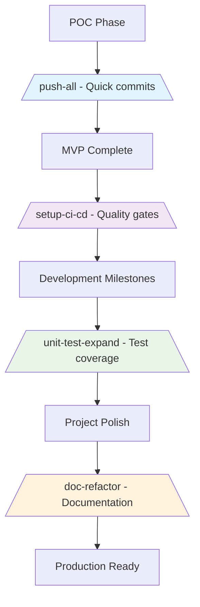
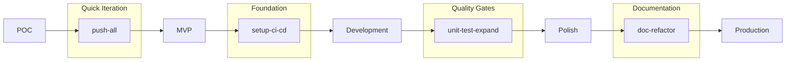

# 4 Essential Slash Commands I Use in Every Project

*Building on the foundation of [Discovering Claude Code Slash Commands](https://medium.com/@luongnv89/discovering-claude-code-slash-commands-cdc17f0dfb29), this post focuses on the practical workflow commands I've found most valuable across different development phases.*

---

## Introduction

After mastering the basics of Claude Code slash commands, I discovered that certain commands became indispensable across every project. These four commands form a complete development workflow—from quick commits to comprehensive project infrastructure.

In this post, I'll share how I integrate these commands into my development lifecycle, when to use each one, and practical tips for getting the most value from them.

---

## Development Workflow Overview



---

## 1. `/push-all` - When You Need to Push Changes

**Best for**: Quick deployment of coherent changesets
**When to use**: Multiple related changes that belong together
**Project phase**: Any phase, especially POC and rapid iteration

### Why I Use It

The `/push-all` command has become my go-to for situations where I've made multiple interconnected changes that need to be committed together. Unlike manual git workflows, this command provides comprehensive safety checks that prevent me from accidentally committing sensitive information.

### Key Features

- **Safety First**: Automatically scans for secrets, API keys, and large files
- **Smart Commit Messages**: Generates conventional commit messages based on changes
- **Confirmation Required**: Presents a clear summary before executing
- **Error Recovery**: Handles common git issues automatically

### When to Use `/push-all`

✅ **Perfect for:**
- Multi-file documentation updates
- Feature implementations with tests and docs
- Bug fixes across multiple files
- Project-wide formatting/refactoring
- Configuration changes

❌ **Avoid when:**
- You're uncertain what's being committed
- Contains sensitive data
- Working on protected branches
- You want granular commit history

### Full Command Reference

Since this command exceeds 30 lines (153 lines total), you can view the complete implementation here:

**[📄 View complete `/push-all` command](../01-slash-commands/push-all.md)**

---

## 2. `/setup-ci-cd` - After POC Completion

**Best for**: Establishing quality infrastructure
**When to use**: After completing POC, before scaling development
**Project phase**: POC → MVP transition

### Why I Use It

Once my POC is working and I'm ready to build a proper project, `/setup-ci-cd` ensures I have the right quality gates in place. It adapts to my project's tech stack and sets up both pre-commit hooks and GitHub Actions without me having to research best practices for each language.

### Command Content

```markdown
---
name: Setup CI/CD Pipeline
description: Implement pre-commit hooks and GitHub Actions for quality assurance
tags: ci-cd, devops, automation
---

# Setup CI/CD Pipeline

Implement comprehensive DevOps quality gates adapted to project type:

1. **Analyze project**: Detect language(s), framework, build system, and existing tooling
2. **Configure pre-commit hooks** with language-specific tools:
   - Formatting: Prettier/Black/gofmt/rustfmt/etc.
   - Linting: ESLint/Ruff/golangci-lint/Clippy/etc.
   - Security: Bandit/gosec/cargo-audit/npm audit/etc.
   - Type checking: TypeScript/mypy/flow (if applicable)
   - Tests: Run relevant test suites
3. **Create GitHub Actions workflows** (.github/workflows/):
   - Mirror pre-commit checks on push/PR
   - Multi-version/platform matrix (if applicable)
   - Build and test verification
   - Deployment steps (if needed)
4. **Verify pipeline**: Test locally, create test PR, confirm all checks pass

Use free/open-source tools. Respect existing configs. Keep execution fast.
```

### What It Sets Up

- **Pre-commit hooks**: Local quality checks before each commit
- **GitHub Actions**: CI/CD pipeline for pull requests and pushes
- **Language-specific tools**: Automatically detects and configures the right tools
- **Security scanning**: Integrates security best practices
- **Multi-platform support**: Configures testing across different environments

---

## 3. `/doc-refactor` - After MVP Completion

**Best for**: Project documentation organization
**When to use**: After MVP is functional, before scaling team
**Project phase**: MVP → Production preparation

### Why I Use It

Documentation often becomes an afterthought during MVP development. `/doc-refactor` helps me reorganize scattered documentation into a coherent structure that scales with the team and project.

### Command Content

```markdown
---
name: Documentation Refactor
description: Restructure project documentation for clarity and accessibility
tags: documentation, refactoring, organization
---

# Documentation Refactor

Refactor project documentation structure adapted to project type:

1. **Analyze project**: Identify type (library/API/web app/CLI/microservices), architecture, and user personas
2. **Centralize docs**: Move technical documentation to `docs/` with proper cross-references
3. **Root README.md**: Streamline as entry point with overview, quickstart, modules/components summary, license, contacts
4. **Component docs**: Add module/package/service-level README files with setup and testing instructions
5. **Organize `docs/`** by relevant categories:
   - Architecture, API Reference, Database, Design, Troubleshooting, Deployment, Contributing (adapt to project needs)
6. **Create guides** (select applicable):
   - User Guide: End-user documentation for applications
   - API Documentation: Endpoints, authentication, examples for APIs
   - Development Guide: Setup, testing, contribution workflow
   - Deployment Guide: Production deployment for services/apps
7. **Use Mermaid** for all diagrams (architecture, flows, schemas)

Keep docs concise, scannable, and contextual to project type.
```

### Documentation Structure It Creates

```
project/
├── README.md (streamlined entry point)
├── docs/
│   ├── architecture/
│   ├── api-reference/
│   ├── user-guide/
│   ├── development-guide/
│   └── deployment/
└── src/
    └── [component]/README.md
```

---

## 4. `/unit-test-expand` - After Each Milestone

**Best for**: Systematic test coverage improvement
**When to use**: After completing development milestones
**Project phase**: Throughout development, at milestone checkpoints

### Why I Use It

Instead of letting test coverage lag behind, I use `/unit-test-expand` at each milestone to systematically identify and fill testing gaps. It's particularly valuable for catching edge cases and error paths that manual testing often misses.

### Command Content

```markdown
---
name: Expand Unit Tests
description: Increase test coverage by targeting untested branches and edge cases
tags: testing, coverage, unit-tests
---

# Expand Unit Tests

Expand existing unit tests adapted to project's testing framework:

1. **Analyze coverage**: Run coverage report to identify untested branches, edge cases, and low-coverage areas
2. **Identify gaps**: Review code for logical branches, error paths, boundary conditions, null/empty inputs
3. **Write tests** using project's framework:
   - Jest/Vitest/Mocha (JavaScript/TypeScript)
   - pytest/unittest (Python)
   - Go testing/testify (Go)
   - Rust test framework (Rust)
4. **Target specific scenarios**:
   - Error handling and exceptions
   - Boundary values (min/max, empty, null)
   - Edge cases and corner cases
   - State transitions and side effects
5. **Verify improvement**: Run coverage again, confirm measurable increase

Present new test code blocks only. Follow existing test patterns and naming conventions.
```

### Testing Gaps It Targets

- **Error paths**: Exception handling and failure scenarios
- **Boundary conditions**: Edge values at limits and empty states
- **State transitions**: Side effects and state changes
- **Integration points**: Cross-component interactions
- **Security scenarios**: Input validation and authorization

---

## Integration Into Development Lifecycle

### Phase-Based Usage



### My Typical Workflow

1. **POC Phase**: Use `/push-all` frequently for rapid iteration
2. **MVP Complete**: Run `/setup-ci-cd` to establish quality infrastructure
3. **Development Sprints**: Use `/unit-test-expand` at each milestone
4. **Pre-Production**: Execute `/doc-refactor` for project documentation
5. **Ongoing**: `/push-all` continues to serve for coherent changesets

---

## Tips for Maximum Value

### 1. Customize Commands for Your Project

While these commands work out-of-the-box, I often customize them for project-specific needs:

```bash
# Add project-specific patterns to push-all safety checks
# Customize doc-refactor for your documentation standards
# Extend unit-test-expand with your testing framework preferences
```

### 2. Team Adoption

- **Start with `/push-all`**: Easiest to adopt and provides immediate value
- **Progressive introduction**: Add commands as the project matures
- **Document customizations**: Keep track of project-specific modifications

### 3. Integration with Existing Workflows

These commands complement rather than replace existing practices:

- **Git hooks**: Can trigger these commands automatically
- **CI/CD pipelines**: Use them as templates for pipeline steps
- **Code reviews**: Reference command outputs in review discussions

---

## Conclusion

These four slash commands have transformed how I approach project development:

- **`/push-all`** provides safety and speed for coherent changes
- **`/setup-ci-cd`** establishes quality foundations without research overhead
- **`/unit-test-expand`** ensures systematic test coverage improvement
- **`/doc-refactor`** creates scalable documentation structures

Together, they form a complete workflow that adapts to different project phases while maintaining consistency and quality standards.

The real power comes from integrating them into your natural development rhythm—not as additional overhead, but as tools that make each phase more efficient and reliable.

---

## Next Steps

1. **Try `/push-all`** on your next multi-file change
2. **Run `/setup-ci-cd`** after your next POC completion
3. **Use `/unit-test-expand`** at your next milestone
4. **Execute `/doc-refactor`** before your next team expansion

Have questions or want to share your own essential slash commands? [Join the discussion](https://github.com/luongnv89/claude-howto/issues) in the claude-howto repository.

---

*This post is part of the [claude-howto](../) project, which provides comprehensive examples and documentation for Claude Code features.*
